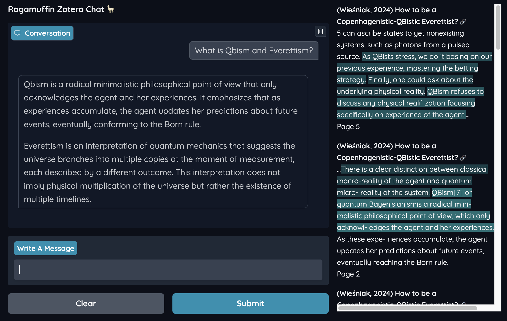

# Ragamuffin - Zotero Chat

Ragamuffin is a [RAG][rag]-powered chat agent which can access your [Zotero][zotero] library.

You can ask questions, and the agent will respond using information from documents in your collection.
It will also display the sources used to generate each answer.

Ragamuffin is built with the amazing [LlamaIndex][llama-index], [SBERT][sbert], and [Transformers][transformers]
libraries and uses [Gradio][gradio] for the user interface.

## Installation

### Pre-requisites

Ragamuffin requires Python 3.10 or higher and a working installation of [Cassandra DB](https://cassandra.apache.org/).

Install Cassandra DB and create a keyspace named `ragamuffin`.

On a Mac, you can install Cassandra using [Homebrew](https://brew.sh/):

    $ brew install cassandra
    $ brew services start cassandra
    $ cqlsh
    cqlsh> CREATE KEYSPACE ragamuffin WITH replication = {'class': 'SimpleStrategy', 'replication_factor': 1};

### Install Ragamuffin in a virtual environment

    $ python3 -m venv venv
    $ source venv/bin/activate
    (venv) $ pip install git+https://github.com/postrational/ragamuffin.git

## Usage

In order to use Ragamuffin, you need to generate a Zotero API key and an OpenAI API key.
Set these as environment variables before running the chat agent. 

    $ export ZOTERO_LIBRARY_ID=1234567
    $ export ZOTERO_API_KEY=XXXX........
    $ export OPENAI_API_KEY=sk-proj-XXXX........

### Generate a RAG index based on your Zotero library

    (venv) $ zotero-chat --generate

This will generate a RAG index based on the papers in your Zotero library.

Later, you can chat with Ragamuffin using the `zotero-chat` command:

    (venv) $ zotero-chat

### Create a Chat Agent based on a directory of documents

You can also generate a RAG index based on a directory of files (e.g. PDFs, EPUB, etc.).

Use the `muffin` command to generate an agent named `my_agent` based on the documents in `/path/to/my/documents/`:

    (venv) $ muffin generate my_agent /path/to/my/documents/

Start the chat agent using the following command:

    (venv) $ muffin chat my_agent

[rag]: https://en.wikipedia.org/wiki/Retrieval-augmented_generation
[zotero]: https://www.zotero.org/
[llama-index]: https://www.llamaindex.ai/
[gradio]: https://www.gradio.app/
[sbert]: https://sbert.net/
[transformers]: https://huggingface.co/transformers/